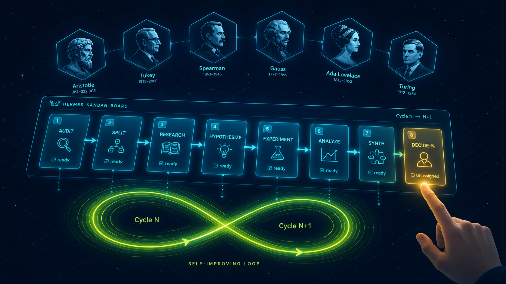

# Essay Auto-Scoring Research

> **한국어 K-12 서술형 에세이 자동채점 워크플로우** —
> Hermes Multi-Agent Kanban Board 기반 **24시간 자가발전 long-running cycle** 검증 프로젝트

[]() []() []() []()

---



## 본 프로젝트가 검증하는 것

**모델 성능 X, Hermes 워크플로우 자가발전 동작 ✓**

- Sample 342건 (toy) + 라이트 모델 (dummy → length → TF-IDF → LightGBM)
- 6 profile (philosopher/scientist 명명) × AGENTS.md × board_config.yaml
- **사용자 부담**: cycle당 DECIDE 1클릭만
- **자율 영역**: audit → split → feature → model → eval → review → synth → 다음 cycle 자체 등록

---

## Quick Start

### 1. 환경

```bash
# Hermes Agent 설치 (WSL2 권장)
pip install hermes-agent
hermes setup

# Codex CLI (worker runtime)
hermes login codex

# Python 의존성 (cron sandbox network=false라 사전 설치 필수)
pip install pandas scikit-learn lightgbm mlflow
```

### 2. 보드 + 초기 task 등록

```bash
# 보드 생성
hermes kanban boards create essay-auto-scoring-research-v2 \
  --name "서술형 자동채점 연구 v2" --icon "🔁"
hermes kanban boards switch essay-auto-scoring-research-v2

# AGENTS.md, MILESTONE.md, configs/board_config.yaml은 본 repo에 포함됨
# Cycle 1 sub-task 8개 등록 (mixed 한글 명명)
# 자세한 명령은 docs/cycle_task_chain_v_1_1.md 참조
```

### 3. Gateway 가동

```bash
hermes gateway run                     # foreground (WSL 권장)
# 또는
hermes gateway install && hermes gateway start   # systemd 자동 시작
```

→ Gateway가 web UI (http://localhost:9119/kanban) + embedded dispatcher (60초 tick) 통합 가동.

### 4. 실행

1. UI 접속 → AUDIT 카드 자동 spawn 확인 (60초 안)
2. Cycle 1 자율 chain 진행 (~30-40분, 사용자 개입 0)
3. DECIDE-1 ready → 사용자가 `[Continue]` 코멘트 + 완료 처리
4. Cycle 2 자동 시작
5. 반복 (cycle당 DECIDE 1클릭)

---

## 프로젝트 구조

```
essay-auto-scoring-research/
├── AGENTS.md                          ← 11 Hard Rules, Cycle Sub-task Pattern, DECIDE Pattern
├── MILESTONE.md                       ← Hard Rule #10 goal anchor source
├── README.md                          ← 본 문서
├── ACCEPTANCE_CRITERIA.yaml           ← toy/mid/full 3단계 acceptance
├── configs/
│   ├── board_config.yaml              ← cost cap + timeout + terminal conditions
│   └── rubric_weights.yaml            ← Hard Rule #4 외부화
├── dataset/                           ← 원본 (read-only)
│   ├── sample/                        ← 342건 (5장르)
│   └── *.pdf                          ← 참고 (직접 파싱 X)
├── pipelines/                         ← worker가 생성한 파이프라인 코드
│   ├── audit_data.py
│   ├── make_splits.py
│   ├── build_features.py
│   ├── train.py
│   ├── evaluate.py
│   └── build_report.py
├── workspace/                         ← cycle별 산출물 (격리)
│   ├── cycle_1/
│   │   ├── audit/
│   │   ├── splits/
│   │   ├── features/
│   │   ├── models/
│   │   ├── eval/
│   │   ├── review/
│   │   └── final/
│   └── cycle_2/ ...
├── mlruns/                            ← MLflow tracking (cycle_id tag로 cycle 추적)
├── reports/latest/                    ← 누적 리포트 (cumulative_report.html 등)
├── docs/                              ← 분석/리서치/PPT 문서
│   ├── (1차 검증)
│   │   ├── hermes_validation_v_1_0.md
│   │   ├── final_report_v_1_0.md
│   │   └── hermes_kanban_토이_검증_파이프라인_구조_v_1_0.md
│   ├── (2차 자가발전)
│   │   ├── self_improving_architecture_v_1_0.md
│   │   ├── escalation_matrix_v_1_0.md
│   │   ├── cycle_roadmap_v_1_0.md
│   │   ├── cycle_task_chain_v_1_1.md
│   │   └── mlflow_기반_..._v_1_0.md
│   ├── (외부 evidence)
│   │   └── research/self_improving_long_running_research_v_1_0.md
│   └── (발표 자료)
│       ├── ppt_slides_v_1_0.md       ← 1차 사이클 (38 slides)
│       ├── ppt_slides_v_1_1.md       ← 자가발전 확장 (17 slides addendum)
│       └── ppt_narrative_v_1_0.md
└── .git/, .agents/, .codex/           ← Hermes/Codex 내부
```

---

## 핵심 architecture (한 장 요약)

```
Setup (1회)
  ├ AGENTS.md (11 Hard Rules)
  ├ MILESTONE.md (goal anchor)
  ├ board_config.yaml (cost + timeout + terminal)
  └ Cycle 1 sub-task 8개 등록

Cycle N (자율 chain)
  AUDIT → SPLIT → FEATURE → MODEL → (EVAL || REVIEW) → SYNTH
  └ SYNTH가 Cycle N+1 sub-task 자체 등록 (옵션 #1)

DECIDE-N (인간, cycle당 1클릭)
  ├ [Continue] → Cycle N+1 chain 시작
  ├ [Phase-up] → Phase 전환 인간 게이트
  └ [Stop]     → 종결

Terminal (자동 종료, board_config terminal_conditions)
  ├ acceptance_pass
  ├ max_cycles_reached (30)
  ├ explicit_stop_decided
  └ max_consecutive_failures_reached (3)
```

상세: `docs/self_improving_architecture_v_1_0.md`, `docs/cycle_task_chain_v_1_1.md`

---

## 6 Profile 역할

| Profile | 역할 | Cycle 단계 |
|---|---|---|
| **aristotle** | 연구 오케스트레이터 | SYNTH (다음 cycle 자체 등록) |
| **tukey** | 데이터 감사관 | AUDIT |
| **gauss** | 모델 엔지니어 | SPLIT, FEATURE, MODEL |
| **spearman** | 평가 통계 분석가 | EVAL |
| **turing** | 코드 + leakage 리뷰 | REVIEW |
| **ada-lovelace** | 코드 작성 (worker 보조) | (필요 시 spawn) |

→ 6 profile은 **재사용 가능 페르소나**. 도메인 룰은 AGENTS.md, 페르소나는 SOUL.md.

---

## 사용 방법

### Web UI (http://localhost:9119/kanban)

| Action | 방법 |
|---|---|
| 카드 상태 확인 | 보드 진입 |
| 새 task 등록 | "+ 이 열에 작업 만들기" |
| DECIDE 결정 | 카드 클릭 → 코멘트 → "완료" 버튼 |
| dispatcher 강제 tick | "디스패처 깨우기" |
| 보드 가독성 | filterCards 또는 showArchived 토글 |

### CLI 기본

```bash
# 보드/task 조회
hermes kanban ls
hermes kanban show <task_id>

# 등록/수정
hermes kanban create "<title>" --assignee <profile> --workspace dir:<path> --parent <id>
hermes kanban comment <task_id> "<text>"
hermes kanban complete <task_id>

# 진단/복구
hermes kanban diagnostics
hermes kanban reclaim <task_id>          # 멈춘 worker release
hermes kanban dispatch --max 1           # 1회 tick (UI "디스패처 깨우기"와 동일)

# 리포트
python3 pipelines/build_report.py        # MLflow 누적 → HTML/CSV
```

---

## 검증 결과 (2026-05-27 현재)

### 1차 사이클 (essay-auto-scoring-research 보드, archived)
- Hermes workflow validation: **8/9 PASS** (cron trigger만 미관찰)
- Pipeline acceptance: BLOCK (T7이 label-side feature leakage 발견)

### 2차 자가발전 사이클 (essay-auto-scoring-research-v2 보드, 진행 중)
- Cycle 1: **PASS_CANDIDATE**, leakage 0, M4 QWK 0.2402 (95% CI 0.16~0.31)
- Hard Rule #9 (Feature provenance) 작동 → 1차 leakage 재발 방지 성공
- Cycle 2: AUDIT-2 진행 중 (자동 시작)
- 사용자 부담: DECIDE-1 1클릭

---

## 문서 가이드

| 목적 | 문서 |
|---|---|
| 첫 진입 (5분) | 본 README |
| Architecture 이해 (30분) | `docs/self_improving_architecture_v_1_0.md` |
| Cycle 운영 (15분) | `docs/cycle_task_chain_v_1_1.md` |
| MLflow 운영 (30분) | `docs/mlflow_기반_..._v_1_0.md` |
| 외부 evidence (60분) | `docs/research/self_improving_long_running_research_v_1_0.md` |
| 1차 사이클 분석 | `docs/hermes_validation_v_1_0.md`, `docs/final_report_v_1_0.md` |
| 발표 (90분) | `docs/ppt_slides_v_1_0.md` + `docs/ppt_slides_v_1_1.md` + `docs/ppt_narrative_v_1_0.md` |
| 에스컬레이션 정책 | `docs/escalation_matrix_v_1_0.md` |

---

## Phase 진화 (toy → mid → full → production)

| Phase | Sample | Models | Hard Rule 5/8 | 현 상태 |
|---|---|---|---|---|
| **1 Toy** | 342 | dummy~LightGBM | warn-only | ✓ Cycle 1 PASS_CANDIDATE |
| **2 Mid** | 5K | + KLUE-RoBERTa | hard-block | 대기 (Phase-up DECIDE) |
| **3 Full** | 50K | + Ensemble + bias audit | hard-block | 대기 |
| **4 Production** | 50K | Champion alias + 배포 | 인간+법무 게이트 | 대기 |

---

## Forbidden (Toy Phase, AGENTS.md §Forbidden)

- 풀데이터 50K 로드
- Transformer 학습 (KLUE-RoBERTa 등)
- Final model registration
- Hard Rule 본문 자율 수정 (LOCKED)
- 외부 script로 cycle 자동화 (board native만 허용)

---

## 참고

- Hermes Agent: https://hermes-agent.nousresearch.com/
- 외부 evidence: Voyager (NeurIPS 2023), AutoGPT failure cases, Cognition Devin, Anthropic Multi-Agent Research, Replit Agent 3
- GitHub Issues: #5736 (openai-codex NoneType), #30908 (kanban DB SQL I/O)

---

## License

내부 연구용 (사용자가 별도 명시).
