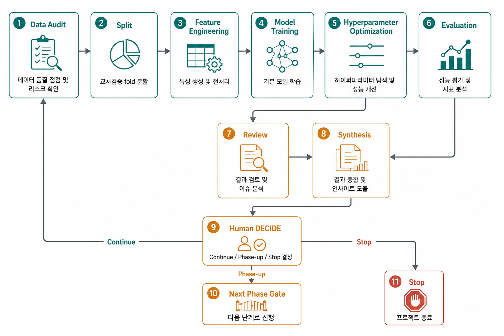

# Hermes Autonomous Research Workflow

<p>
  
  
  
  
  
  
  
  
  
  
  
</p>


Hermes Multi-Agent Kanban Board가 장시간 연구 작업을 추적 가능하고 자가 복구 가능한 방식으로 자율 실행할 수 있는지 검증하는 연구 프로젝트입니다.

검증 사례로는 **한국어 K-12 서술형 에세이 자동채점**을 사용합니다. 이 저장소의 1차 목적은 채점 모델 제품화가 아니라, 실제 ML 연구 과제를 통해 Hermes 기반 장기 자율 연구 workflow의 안정성, 추적성, 품질 개선 가능성을 확인하는 것입니다.

## What This Project Validates

이 프로젝트는 단일 모델 성능 실험이 아니라, 연구 workflow 자체를 검증합니다.

| 검증 대상 | 설명 |
|---|---|
| Long-running execution | Hermes worker가 여러 시간 이상 이어지는 연구 chain을 지속 실행할 수 있는지 확인 |
| Kanban-native dependency | AUDIT, SPLIT, FEATURE, MODEL, HPO, EVAL, REVIEW, SYNTH, DECIDE 단계를 보드 의존성으로 연결 |
| Traceability | task body, 산출물 경로, MLflow run, Optuna study, commit evidence를 연결 |
| Self-recovery | split 실패, 환경 제약, 장시간 작업 중단 같은 문제를 worker가 evidence를 남기며 복구 |
| Human gate | DECIDE task에서 `[Continue]`, `[Phase-up]`, `[Stop]`으로 cycle 진행을 명시적으로 통제 |
| Quality evolution | baseline에서 Transformer/HPO/ensemble로 이어지는 모델 개선이 실제로 발생하는지 검증 |

## Case Study

한국어 K-12 서술형 에세이 자동채점 연구는 Hermes workflow를 검증하기 위한 현실적인 ML benchmark입니다.

| 항목 | 내용 |
|---|---|
| Domain | 한국어 K-12 서술형 에세이 자동채점 |
| Data | AI Hub Training 기반 5,003건 stratified sample |
| Task | rubric별 점수와 overall 점수를 함께 예측하는 multi-task regression |
| Models | M1 dummy, M2 length, M3 TF-IDF+Ridge, M4 LightGBM, M5 KLUE-RoBERTa, M6 ensemble |
| Optimization | Optuna Hyperparameter Optimization |
| Tracking | MLflow + SQLite |
| Evaluation | QWK, RMSE, MAE, rubric별 metric, score-band fairness |

## Workflow Overview



각 단계는 Hermes Kanban task로 등록되고, parent dependency를 통해 다음 단계가 자동으로 ready 상태가 됩니다. 장시간 작업은 worker foreground가 아니라 외부 실행 + progress polling 방식으로 추적합니다.

## Current State

| 항목 | 현재 값 |
|---|---|
| Active board | `essay-auto-scoring-research-phase3` |
| Phase | Phase 3 Mid Multi-task |
| Primary data | `dataset/sample_5k/` |
| Active cycle | `M2R` recovery chain |
| Models | M1-M4 CPU baseline, M5 multi-task KLUE-RoBERTa, M6 multi-output ensemble |
| Tracking | `sqlite:///mlflow.db`, `sqlite:///optuna.db` |
| Human gate | `DECIDE-*`에서 `[Continue]`, `[Phase-up]`, `[Stop]` |

Source of truth:

- Project rules: `AGENTS.md`
- Phase goal: `MILESTONE_v3.md`
- Gates: `ACCEPTANCE_CRITERIA.yaml`
- Docs index: `docs/README.md`

## Quick Start

```bash
# 환경 확인
python3 -c "import pandas, sklearn, lightgbm, mlflow, transformers, datasets, accelerate, optuna"

# active board 확인
hermes kanban boards list
hermes kanban stats
hermes kanban list --sort created

# 현재 작업 상세
hermes kanban show <task_id>
hermes kanban runs <task_id>
```

Dashboard:

```text
http://localhost:9119/kanban
```

## Data

| 위치 | 용도 |
|---|---|
| `dataset/1.Training/라벨링데이터/` | AI Hub Training 원본, read-only |
| `dataset/2.Validation/라벨링데이터/` | final holdout 후보, 현재 학습 fold 포함 금지 |
| `dataset/sample_5k/` | Phase 3 primary sample, Training에서 stratified seed=42 추출 |
| `dataset/sample/` | Phase 1 toy evidence, read-only |

5K 표본 재생성:

```bash
python3 -m pipelines.extract_5k dataset/1.Training \
  --out dataset/sample_5k \
  --target-n 5000 \
  --seed 42
```

## Pipeline

```bash
# 데이터 audit
python3 pipelines/audit_data.py --input dataset/sample_5k/

# split 생성: 기본 k=5
python3 pipelines/make_splits.py \
  --input dataset/sample_5k/ \
  --k 5 \
  --output workspace/cycle_M<N>/splits \
  --cycle-id M<N> \
  --kanban-task-id <task_id> \
  --min-valid-n 300 \
  --group-key student.location

# M2 승인 fallback: 기본 k=5 valid_n 실패 evidence 보존 후 region merge + k=3
python3 pipelines/make_splits.py \
  --input dataset/sample_5k/ \
  --k 3 \
  --output workspace/cycle_M<N>/splits \
  --cycle-id M<N> \
  --kanban-task-id <task_id> \
  --min-valid-n 300 \
  --group-key region \
  --audit-table workspace/cycle_M<N>/audit/data_audit/audit_table_no_raw_text.csv

# CPU baseline
python3 -m pipelines.train \
  --models M1,M2,M3,M4 \
  --cycle-id M<N> \
  --mlflow-uri sqlite:///mlflow.db

# Phase 3 acceptance용 M5/M6는 legacy scalar command 금지.
# multi-task launcher/spec은 docs/multi_task_채점모델_구현_스펙_v_1_1.md를 따른다.

# HPO
python3 -m pipelines.run_hpo \
  --model M4 \
  --cycle-id M<N> \
  --n-trials 30 \
  --study-name cycle_M<N>_M4 \
  --storage sqlite:///optuna.db \
  --mlflow-uri sqlite:///mlflow.db \
  --experiment-name essay-auto-scoring-phase3 \
  --kanban-task-id <task_id> \
  --split-dir workspace/cycle_M<N>/splits \
  --feature-dir workspace/cycle_M<N>/features \
  --label-dir dataset/sample_5k/ \
  --output-dir workspace/cycle_M<N>/hpo

# 평가
python3 pipelines/evaluate.py --cycle-id M<N>
```

Vast.ai 인증 확인은 `vastai show user`를 쓰지 않습니다. CLI 0.5.0이 현재 API에 `owner=me`를 붙여 실패할 수 있습니다.

```bash
vastai --api-key "$VAST_API_KEY" show instances --raw
vastai --api-key "$VAST_API_KEY" search offers 'gpu_ram>=8 reliability>0.95' --raw
```

## Repository Layout

```text
.
├── AGENTS.md
├── MILESTONE.md
├── MILESTONE_v2.md
├── MILESTONE_v3.md
├── ACCEPTANCE_CRITERIA.yaml
├── VAST_GPU_GUIDE.md
├── configs/
├── pipelines/
├── tests/
├── docs/
│   ├── README.md
│   ├── archive/
│   └── research/
├── reports/          # optional generated reports, ignored when absent
├── skills/
├── workspace/        # ignored runtime artifacts
├── mlflow.db         # ignored runtime DB
└── optuna.db         # ignored runtime DB
```

## Hermes Agent Profiles

| Profile | 책임 |
|---|---|
| `aristotle` | SYNTH, cycle report, 다음 cycle 등록 |
| `tukey` | AUDIT |
| `gauss` | SPLIT, FEATURE, MODEL, HPO |
| `spearman` | EVAL |
| `turing` | REVIEW |
| `ada-lovelace` | 구현 보조 |

## Governance

운영 기준은 루트 문서와 `docs/README.md`의 active 문서 목록을 따릅니다.

| 문서 | 역할 |
|---|---|
| `AGENTS.md` | Hermes worker 행동 규칙과 hard rules |
| `ACCEPTANCE_CRITERIA.yaml` | phase별 acceptance gate |
| `MILESTONE_v3.md` | Phase 3 목표와 성공 기준 |
| `docs/phase_3_operations_guide_v_1_0.md` | 운영 절차 |
| `docs/multi_task_채점모델_구현_스펙_v_1_1.md` | multi-task 모델 구현 스펙 |

완료된 Phase 1/2 문서, 발표 자료, 리뷰 체크리스트, 구버전 스펙은 `docs/archive/` 아래에 보관합니다.

## License

Code in this repository is licensed under the [MIT License](LICENSE).

Dataset files, source PDFs, and external model/data assets remain subject to
their original provider terms. Verify redistribution rights before reusing data
files outside this repository.
